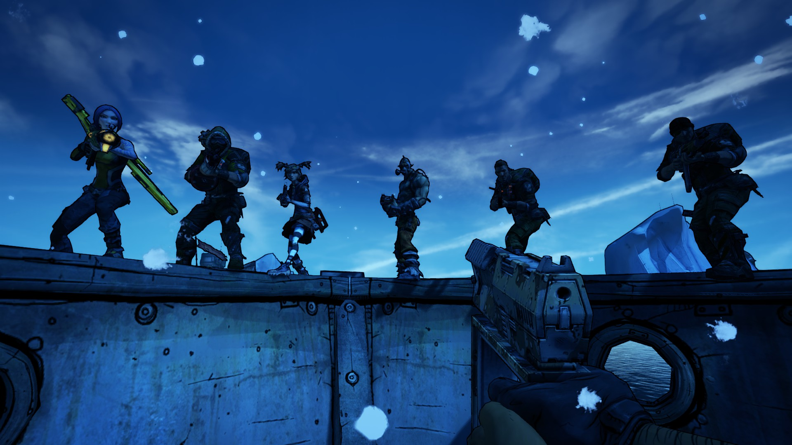

# NoCap
### a willow2 pythonsdk lobby extension mod by stelmo 
shoutouts to [Robeth](https://github.com/RobChiocchio) for his previous unlimited coop mod, cooppatch, and documentation

---

### Usage:
##### ONLY REQUIRED ON HOST
- HOST
    - Install the [PythonSDK](https://bl-sdk.github.io/willow2-mod-db/) and [NoCap](https://github.com/stealmyhousekey/willow2-sdk-mods/raw/refs/heads/main/nocap/nocap.sdkmod)
    - Enable mod [Main Menu → Mods → NoCap]
    - Set desired number of teams (and any other options) in mod settings menu
    - Start the game SOLO
    - Tell clients whenever you have loaded in
- CLIENTS
    - Wait until host tells you to join
    - Join game
        - Main menu join may fail, try connecting via Steam/Epic if so
    - Play as normal

---

### Settings:
##### All settings are controlled by host

| Setting                  | Description                                                                                       |
|--------------------------|---------------------------------------------------------------------------------------------------|
| Team Count               | How many teams are allowed in-game; determines total number of player slots (Teams * 4)           |
| Network Settings         | Choose from multiple network config presets to optimize latency/hitreg                            |
| Enable CoopPatch Fixes   | Automatically apply fixes from Robeth's CoopPatch for things like HP, experience, and kill skills. This should be disabled if using other hotfix TextMods. |
| Enable Max Scaling              | Always scale lobby to 4 player enemy difficulty (maximum allowed by game)                         |

 

| Vehicle Options          | Description                                                                                       |
|--------------------------|---------------------------------------------------------------------------------------------------|
| Enable Vehicle Tweaks    | Allows all vehicles to be spawned at any vehicle digistruct terminal (with mod installed) Allows players to stand on top of vehicles |
| Enable Health Fix        | Fixes the 20hp vehicle bug by scaling minimum vehicle health based on the host's max health       |
| Health Fix Scaling       | Set the scaling factor for player vehicle health when using the Health Fix Vehicle health = Host's Max Health * ScalingFactor |

 

| Miscellaneous Options    | Description                                                                                       |
|--------------------------|---------------------------------------------------------------------------------------------------|
| Enable Logging           | Enable console debug logging (Recommended)                                                        |

---

 ### FAQ:
 ##### `Which games does NoCap work with?`

| Game                          | Status                                      |
|-------------------------------|---------------------------------------------|
| Borderlands 1                 | UNTESTED (Might work; waiting for official PythonSDK)   |
| Borderlands 2                 | WORKING                                     |
| The Pre-Sequel                | WORKING                                     |
| Assault on Dragon Keep        | UNTESTED (Should work)                      |
| Borderlands 3                 | REQUIRES RESEARCH/REWRITE FOR OAK SDK*      |
| Tiny Tina's Wonderlands       | REQUIRES RESEARCH/REWRITE FOR OAK SDK*      |
||* currently focusing on willow2, but plan on playing through and writing mods for oak very soon |

 

##### `Host crashed when the 5th player joined`  
Try lowering team count or adjusting hotfix settings

 

##### `There is bad latency/hitreg with high player counts`  
This is hard to pinpoint an exact cause, but you can try the following:
- Try different Network Settings in mod options
- Set `bHasVoiceEnabled=false` in WillowEngine.ini
- Turn off SHiFT Crossplay
- If using TextMods, make sure every player has applied them
- Make sure whoever is hosting has a strong enough PC and a solid internet connection (wired recommended)

 

##### `There are various UI/HUD related issues`
Many UI elements break when the 5th player joins, this is unfortunately a side effect of going beyond the normal 4 player limit.  
For issues like HUD markers stuck on screen, you can simply open and close the pause menu.

 

##### `How can I make the game more difficult?`  
Install other mods like [Game Scaler](https://bl-sdk.github.io/willow2-mod-db/mods/gamescaler/) and [Spawn Multiplier](https://bl-sdk.github.io/willow2-mod-db/mods/spawnmultiplier/) (these also work host-only)

 

##### `How can I use CoopPatch fixes with other TextMods?`
You will need to download [cooppatch.blcm](https://raw.githubusercontent.com/RobChiocchio/BL2-MP-Mods/refs/heads/latest-csharp/CoopPatch/cooppatch.blcm), then merge and enable the `FIXES` with your other TextMod(s).  
Make sure NOT to merge `CORE` or `NETWORK OPTIMIZATION`, as these will likely conflict with some of the changes made by NoCap

 

---

### Other Issues:
 All of the same issues reported [here](https://steamcommunity.com/sharedfiles/filedetails/?id=1151711689) will likely apply to this mod as well

---

### Disclaimer:
This mod has only been tested with 5-8 players, so any higher player limit is UNCONFIRMED as of now.   
The teams all appear to function correctly however, so I see no reason to believe it shouldn't work.  
(But please let me know if it doesn't!)

---

### License:
This project is licensed under the GNU General Public License v3.0.

NoCap - Copyright © 2024-2025 stealmyhousekey  
CoopPatch - Copyright © 2018 RobethX / RobChiocchio

This program is free software: you can redistribute it and/or modify
it under the terms of the GNU General Public License as published by
the Free Software Foundation, either version 3 of the License, or
(at your option) any later version.

This program is distributed in the hope that it will be useful,
but WITHOUT ANY WARRANTY; without even the implied warranty of
MERCHANTABILITY or FITNESS FOR A PARTICULAR PURPOSE. See the
GNU General Public License for more details.

You should have received a copy of the GNU General Public License
along with this program. If not, see <https://www.gnu.org/licenses/>.